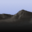
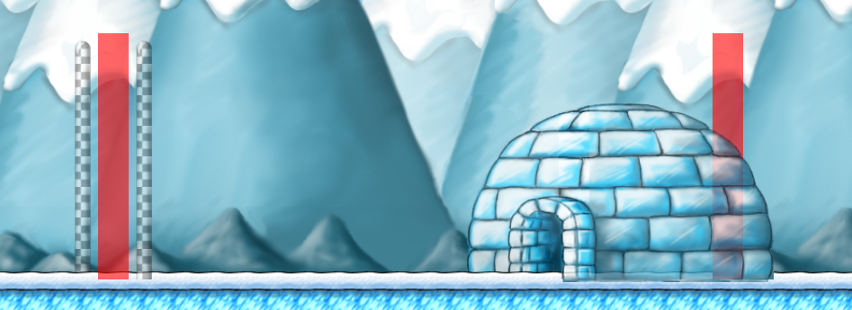
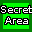
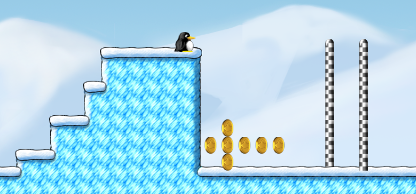
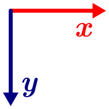

*This guide is meant for SuperTux v0.6.1. Previous version:
[0.6.0](Editor-Guide-0-6-0.md)*

# Your first Level

Click on *Level Editor* from the title menu. Then *Create World*. Give
it a name and click *OK*. To make your first level click on *Create level*.

## The Interface

The panel on the right side is the place where you get all of your blocks
*(Tiles)* and enemies *(Objects)* into your level. With the bottom
panel you can easily switch between the tile maps (let *0* enabled for
now&nbsp;– we will cover that later) and change background, music and the
size of your sector.

When you press <kbd>ESC</kbd>, you can play or save your level and exit
the editor. You can move the viewport of your level with the arrow keys. Use
this to navigate through your level.

If something goes wrong you can undo/redo using the arrows in the top left
corner: 

These actions are also available as keyboard shortcuts! Press <kbd>ESC</kbd>
and select *Keyboard Shortcuts* to see all shortcuts.

## Build a basic Level Framework

### Define the Theme of your Level

Do you want to make a forest level or an underground level or a sky
level? You should have a plan for your level *first* before you start
adding tiles. Everything should suit your level theme:

#### The Music

Right click on  in the bottom bar and
click on *File*. A file picker opens up. Select `[music]`. There is a great
track list to choose from. I will help you choose:

- **Antarctica:** `antarctic/chipdisko.music`, `antarctic/voc-daytime.music`,
  `antarctic/voc-daytime2.music`, `antarctic/arctic_breeze.music`
- **Arctic Cave:** `antarctic/arctic_cave.music`
- **Arctic Map:** `antarctic/salcon.music`
- **Arctic Intro:** `misc/intro.music`
- **Sky:** `antarctic/airship_remix.music`, `antarctic/airship_remix-2.music`
- **Night:** `antarctic/voc-night.music`
- **Cave:** `antarctic/cave.music`, `antarctic/voc-dark.music`,
  `forest/clavelian_march.music`
- **Ice Bridge:** `forest/wisphunt.music`
- **Castle:** `castle/fortress.music`
- **Boss:** `antarctic/bossattack.music`, `antarctic/voc-boss.music`,
  `forest/treeboss.music`
- **Crystal Cave:** `antarctic/jewels.music`
- **Forest:** `forest/forest.music`, `forest/forest2.music`,
  `forest/forest3.music`, `forest/call_of_the_winding_path.music`,
  `forest/beneath_the_rabbit_hole.music`, `forest/forest-sprint.music`,
  `forest/shallow-green.music`
- **Forest Cave:** `forest/forest-cave.music`
- **Forest Castle:** `castle/darkforestkeep.music`
- **Forest Map:** `forest/forest-map.music`, `forest/new_forest_map.music`
- **Forest Outro:** `forest/forest_theme.music`
- **Halloween/Ghostforest:** `forest/ghostforest.music`,
  `forest/ghostforest2.music`, `forest/greatgigantic.music`,
  `misc/halloween_1.music`, `forest/wisphunt.music`
- **Ghostforest Map:** `forest/ghostforest_map.music`
- **Thunder:** `forest/bright_thunders.music`
- **Bonus sectors:** `misc/bonuscave.music`

`.music` files define where to loop the given soundtrack. Prefer them over
`.ogg` files to ensure music sounds nice.

#### The Background

Right click  in the bottom
panel. You can change the top, middle and bottom of the background separately,
which allows you to mix certain images. Since this is also a complete mess
I suggest you to open the SuperTux data folder with your file manager and
pick your images there.

- Linux: `/usr/share/games/supertux2/images/background/`
- Windows: `C:\Program Files\SuperTux\data\images\background\`

Then you can define top, middle and bottom in the editor.

#### The Ambient

If you go for a ghostforest-themed level or just want to make your level
look more interesting, you can add an ambient in *Objects* → *Sector*. The
options you have include:


Click on one of these icons in the editor, then click on the level window. The
ambient will be added to the bottom panel and is activated instantly.

### Let’s get started

What are the requirements for every level?

1. A Sector called *main* (We already have this. Tux will start in
   this sector)
2. A Spawn point called *main* (We already have this. Tux will start
   the level from this point)
3. Something for Tux to walk on
4. A Goal

Now we want to work on number 3.

#### Adding Tiles

Click on *Tiles* in the top-right corner and choose a category that suits
your level theme (in *Block* are tiles you need for every level). Select
a tile you like by clicking on it or select multiple tiles by dragging
a rectangle with your mouse. Your selection is now displayed besides the
cursor. You can place it in your level as many times as you want.


- By right clicking on a tile you can copy it. It is also possible to copy
  a whole area by dragging a rectangle with your mouse.
- 
  is the normal insert tool. By clicking this icon you can switch tools.
- 
  lets you fill rectangular areas.
- 
  fills an area of adjacent tiles of the samy type.
- If you have nothing in your selection the tools work as erasers.
- You can clear your selection with  or by copying an air tile.
- The other tools only take effect in object mode.

#### Adding the Goal

A SuperTux level usually ends like this:



To make the goal poles go to *Tiles* → *Miscellaneous*. For the first pole you
have to switch to tile map *&minus;100*. Then you can draw the pole. For
the second pole you have to switch to tile map *+100*. Then you can draw the
pole. This way we have one pole in the background and the other one in the
foreground which creates this cool 3D effect.

To make the igloo go to *Objects* → *Environment* and select  We are adding an object now. Objects work a little
different than tiles. See the detailed explanation below when you have
problems. Click on the level window to place the decal. You will notice
that the decal doesn’t look like an igloo at all. To fix this right click
on the decal and click on *Sprite*. A file picker opens up. Naviagte to
`/images/decal/snow/` by clicking on `[..]` to move one directory up and
clicking on `[snow]`. Then select `exitbg.png` and click *OK*. This is the
background part of the igloo. Tux’ igloo is split up into two parts to
make it look more 3D.

Now add another decal but choose `exitfg.png` as the sprite this time. But
we aren’t done yet. When you test your level, you will notice that Tux
can walk in front of the part of the igloo that’s supposed to be in the
foreground. To fix this right click on the background decal and change its
z&#8209;positon to a low value like *&minus;100*. For the foreground part
choose *+100*. Now you can drag the two together so that they form a cohesive
shape. That’s much easier when “Grid Snapping“ is activated. You can
check by pressing <kbd>ESC</kbd>.

Now we are done visually, but we still have to tell the game where the
level ends. Go to *Objects* → *Environment* and select  Click on the level window and place
the sequence trigger like shown in the picture. Make sure the first
sequence trigger triggers the action “end sequence” You can change this
by right clicking on the object. The sequence trigger in the igloo is used
to prevent Tux from walking farther right out of the igloo. Make sure its
action is set to “stop Tux”.

Congratulations! You have got everything you need for your first level. Now
it is time to be creative and build your level. You can come back to this
guide at any time and look up your specific problems. What do you want to
do next? Add particular kinds of objects, use secret areas or work with
multiple tile maps? It’s your choice!

# Adding Objects

## How does Object Mode work?

You cannot interact with tiles while you have object mode enabled after
clicking on *Objects* in the top-right corner. Choose any category, for
example *Enemies*. Then you can start adding objects just like tiles. I
will explain everything:

- There are two basic modes: adding/moving and erasing.
- Adding/moving can be activated with  Click to add an object and drag to move
  an existing object around.
- Erasing can be activated with  Click on an existing object to remove it. For some reason
  erasing does not work when copying is active.
- Copying is a child mode of the adding/moving mode. You must have the
  adding/moving mode active to make it work. Copying can be activated by
  clicking on  The icon will change to  You can now drag an existing
  object&nbsp;– it will be duplicated.
- Pro tip: To erase a whole area use  together with erasing mode.
- Right clicking an existing object lets you configure its properties.

I suggest you to enable “Grid Snapping”, which makes placing objects much
easier. Of course, you can disable this for more finely graduated adjusting.

## Doors

Go to *Objects* → *Environment*. Choose the door from the list and add
it. Set a spawn point *(Objects → Environment)* next to the door. Right click
on it to give it a name, for example *spawn_door1*. You also have to right
click on your door to define its destination: The “address” of the
other door. For this we first need a second door. It can be in the same
sector or in a different sector. To add a sector click on *Sector: main*
in the bottom-left corner and *Create a new sector*. Add a door and a spawn
point next to it there. Give the spawn point a name, for example *spawn_door2*.

Now you can define the destinations. Our first door should go to *spawn_door2*
in *sector2*. Our second door should go to *spawn_door1* in *main*. Of
course, we could just omit the second door and only use the bare minimum
(a spawn point) but the players expects the level to let them go back again
after walking through a door.


##  Secret Areas 

Always mark a hidden bonus area with the dedicated object for it. Go to
*Objects* → *Environment* and click on the secret area icon. Drag the object
over your secret so the player gets the “You found a secret area!”
message and the secret is counted for the statistics.

However, the secret area object is also able to let some tiles vanish when
a player touches it. That way you can hide your secrets better in your level
but do not forget to give a little visual hint.



To do this add a new tile map which covers the secret and makes it look like
a solid wall. Go to *Objects* → *Sector*, select  and add it. A new icon appears in the bottom bar. Right
click it and call it for example *secret1*. Once the tile map has a name,
we can refer to it in other objects. Make sure “solid” is not ticked and
change the z&#8209;position to *101* so that it is above everything. Add your
tiles on this tile map to cover the secret. Then you can right click your
secret area object and type *secret1* into the “Fade-tilemap” field. Do
not forget to add tiles on your solid tile map, likely the *0* tile map. This
tile map defines how the secret looks after the *secret1* has vanished.

Adding a custom message to your secret area might seem like a fun idea at
first but leaving the fields empty has the advantage that the default message,
which is already translated into many langauges, is used.

##  Info Blocks

Go to *Objects* → *Environment* and add the info block like any other
object. Use the info block only if something does not become clear from the
level itself or you want to introduce new game mechanics.

Right click the info block to add a message. You can use the first character of
a paragraph for formatting instructions. This character will not be displayed
in the message:

- Use a hyphen-minus (-) for headlines.
- Use an exclamation mark (!) together with the path to an image in the
  supertux2 folder.
- An asterisk (*) makes the text blue and center justified. Use it for quotes
  or extra info.
- A space makes the text small. Hard to read.
- For normal text you can also use a hash (#) which is needed for compatibility
  with older levels.

Sadly, the editor doesn’t allow you to enter multi-line messages. To do this,
you need to open your level with a text editor and search for “infoblock”.

Here’s an example message taken from “Welcome to Antarctica”:

```
(infoblock
  (message (_ "-Bonus Blocks
      !images/objects/bonus_block/full-0.png
      #Bonus blocks can contain coins, power-ups or special items to help you in your quest.
      #
      #Hit them from below to get at their contents.")
  )
  (x 384)
  (y 480)
)
```

## Moving Platforms

You can set a path where platforms, coins and even tile maps (see below)
move on. To do this, click on your object. An adjustment handle at
the top-left corner indicates that *Following path* is activated. Platforms
have this by default&nbsp;– coins and tile maps provide this as a tunable
right click option.

To define the path you have to go to *Objects* → *Environment* and select  If you click anywhere in the level
having activated this tool, it will draw a path between the point you clicked
and the last node you selected. So to make your platform move, click the node
at the top-left corner of the object and click anywhere.

You can change how the object moves on your track by right clicking it and
changing its *Path Mode*:

- *One shot* goes from the start to the end once. Then it stops.
- *Ping-pong* goes back and forth infinitely like playing table tennis.
- *Circular* connects the last node with the first node. The platform goes
  in a circle with no ending.
- *Unordered* seems deprecated. Do not use it.

If you leave *Running* disabled, you have to start the movement with a script:

Let’s make a platform which starts moving when Tux jumps onto it. Place a
script trigger at the top of the platform. Give the platform a unique
name for example *p1*.

- `p1.start_moving();` Start the movement (affected by the option you set).
- `p1.stop_moving();` The platform stops when it reaches a node.
- `p1.goto_node(int node_no);` The platform goes to a specific node. You
  start counting from 0. So `p1.goto_node(0);` lets the platform go to the
  beginning. Then it stops.

#  Working with multiple Tile Maps

You can use different tile maps to organize your tiles and to make using
multiple layers possible. You can add a tile map in *Objects* → *Sector*
and switch between them in the bottom bar.

The most obvious use case is adding foreground and background elements. *50*
is the layer where Tux jumps and all the objects are placed so every tile
on a tile map above *50* is in front of the objects and everything below
is … well … behind. You can change this value with the *Z&#8209;pos*
property in the right click menu of the tile map.

When you edit a new level, you already have three standard tile maps. Tile map
*0* is solid. Use it for blocks for Tux to interact with. Tile map *&minus;100*
and *+100* are not solid. Use them for background and foreground elements.

Another use case is making tiles darker or brighter. Add a new unsolid tile
map and set its alpha to a value between 0 and 1 (0 is 100% transparent). Then
place some black tiles in this tile map over other background blocks. You can
find these black tiles in *Tiles* → *Unisolid + Lightmap*. This way you
can adjust the brightness of every tile.

When you enable the *Following path* property, select a different tile map and
reselect your tile map, you can move the tile map at the adjustment handle
at the top-left corner around and let it move like a moving platform! See
the section above how to do this. You can get inspiration for this in the
level *Crystal Mine* by Carsten Wirtz, which uses this mechanic.

# Working with Lightmaps

Before lanterns and magic blocks can reasonably used, we have to darken
the sector first. Right Click 
in the bottom bar and define the color using RGBA (Right, Green, Blue,
Alpha). Press <kbd>←</kbd> or <kbd>→</kbd> on each color to decrease
or increase its share.

Now you can go to *Objects* → *Environment* and add your things. Give the magic
blocks you want to be made solid by a light source the same color as your
lantern or spotlight.

# Using Scripts in your Level

Scripting lets you move things in your level around and change the level
dynamically (It’s the JavaScript of SuperTux level making&nbsp;– don’t
overuse it!). Have a look at the [Scripting Reference](
https://github.com/SuperTux/supertux/wiki/Scripting_reference#object-reference)
for the commands. There are different ways to trigger a script:

-  A Script trigger object: When Tux enters
  this area a script gets executed.
- *Sector: sector* → *Sector settings* → *Initialization script*: executed when
  entering the sector.
- Badguy → *Death script*: executed when a badguy dies, for example
  `sector.Tux.trigger_sequence("fireworks");` at yeti’s death.
- button/switch press
- power up picking up
- Will ’O’ Wisp hit

# Making a Worldmap for your Levels

In the *Choose World* menu, select your level set and click on *Create
worldmap*. The interface should look pretty familiar. Look at the official
worldmaps to get a clue how a worldmap should look like. I will show you
the basics.

Build an island and draw a path on it. When you are done, go to *Objects*
to add the level dots. Spread them all over your path. Right click them to
define the level.

Make sure the spawn point is properly set. It should be on the same block
as the starting igloo. Try to make your worldmap interesting. Use forks,
shortcuts and most importantly, group your levels as it’s done with the
underground levels in Icy Island. Give the worldmap a structure and don’t
make your level dots too near to each other.

Before you can play your worldmap, you have to activate it. Press
<kbd>ESC</kbd>, click on *Edit another level*, select *World Settings* and
change *Type* to “Worldmap”. After this you can play your worldmap from
the title menu in *Start Game* → *Contrib Levels*.

# Making Intro/Outro Text for your Story

By making an intro or an outro you can give the player an understanding of
the story. This can be a normal level or just some scrolling text over the
whole screen. I’ll show you how to do the latter.

Open a level in your levelset, press <kbd>ESC</kbd> and select *Open level
directory*.

Create a new text file in this folder. Call it for example `intro.txt`
and paste this into it:

```
(supertux-text
  (background "$PATH_TO_IMAGE")
  (music "$PATH_TO_MUSIC")
  (text "$YOUR_TEXT")
)
```

Define background and music. Try for example `"nightsky_top.png"` and
`"music/antarctic/voc-dark.music"`. The text can be formatted just like the
text in info blocks.

Now we have the text but we still need a way to display our text in the
worldmap. To do this we create a new dummy level and add a script trigger
right under the spawn point. Edit the script and type `Level.finish(true);`
so that the level is finished immediately. Now we can add both the text and
the level to the worldmap:

Press <kbd>ESC</kbd>, click on *Edit another level* and select *Edit
Worldmap*. If you haven’t done a worldmap already, see the section above to
make one. Add a new level dot to make your intro or outro accessible via the
worldmap. Right click on it, define the level, then click on *Outro script*
and type:

```
wait_for_screenswitch();
display_text_file("levels/$LEVELSET_NAME/intro.txt");
```

The function `wait_for_screenswitch` waits until the level is finished or
the players presses <kbd>ESC</kbd>.

That’s it! When you enter the level, the text is displayed.

# Making an auto-scrolling Level

Modifying the camera is currently not supported by the level editor. However,
you can edit your level in a text editor:

Press <kbd>ESC</kbd> and select *Open level directory*.

Open your level with a text editor and replace `(camera)` with these lines:

```
(camera
  (name "Camera")
  (mode "autoscroll")
  (path
    (mode "oneshot")
    (node
      (x 0)
      (y 0)
      (time 200)
    )
    (node
      (x 19072)
      (y 0)
    )
  )
)
```

You can adjust the time (less is faster) or adjust the y&#8209;values to
move the camera up or down (bigger is down). Right now the camera is at the
top because SuperTux levels follow this coordinate system:



# Setting a Time Limit for a Sector

Navigate to *Objects* → *Sector*, select 
and add it. The clock icon now appears in the bottom bar. Right click it
and enter the desired time.

# Tips and Tricks

You can learn a lot by looking at other people’s levels in the editor. Copy
`levels/world1/info` and `levels/world2/info` from the data directory to
`levels/world1/info` and `levels/world2/info` (respectively) in your user
directory. Set *hide-from-contribs* in the world’s `info` file to `#f` to
unhide it from the editor. The directories are located at the following places:

- Linux: 
  - data dir: `/usr/share/games/supertux2/`
  - user dir: `~/.local/share/supertux2/`

- Windows: 
  - data dir: `C:\Program Files\SuperTux\data\`
  - user dir: `C:\Users\$USERNAME\AppData\Roaming\SuperTux\supertux2\`
  
- macOS:
  - user dir: `~/Library/Application Support/supertux2/`

Enable developer mode to get access to the cheat menu with <kbd>F1</kbd>:
Change `(developer #f)` to `(developer #t)` in the `config` file of your
user directory.

# See also

- [Leveldesign guidelines](https://github.com/SuperTux/supertux/wiki/Leveldesign)
  in SuperTux Wiki
- [Sharing Levels](https://github.com/SuperTux/supertux/wiki/Level-Editor) in
  SuperTux Wiki
- [Level Format](https://github.com/SuperTux/supertux/wiki/Level-Format) in
  SuperTux Wiki
- [Scripting Reference](https://github.com/SuperTux/supertux/wiki/Scripting_reference#object-reference)
  in SuperTux Wiki
- [Scripting Guide by WeLuvGoatz](https://github.com/SuperTux/wiki/blob/1aabea8358ea9c89373e44af900fdac62a19fd53/scripting.md)
- [Illustrated Tutorial how to make a tile map movable by VNS](
  https://forum.freegamedev.net/viewtopic.php?f=69&t=7265#p73970)

Any questions left? Go ahead and ask them in the [SuperTux forum](
https://forum.freegamedev.net/viewforum.php?f=66)!

This page is licensed under [CC-BY-SA](
https://creativecommons.org/licenses/by-sa/4.0/).
