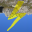
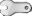
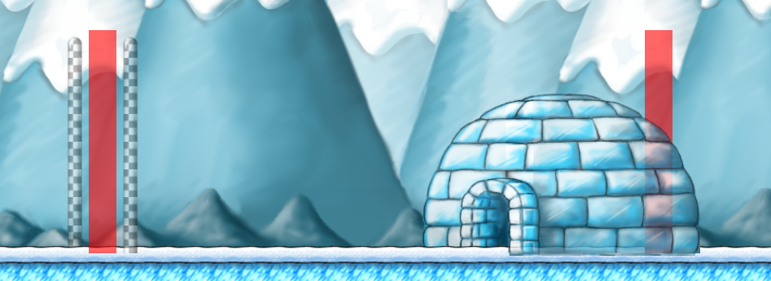
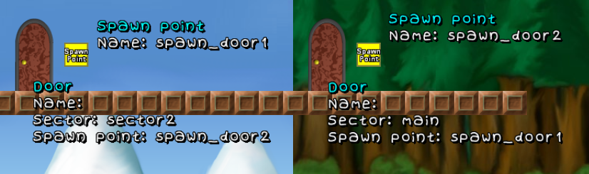
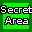
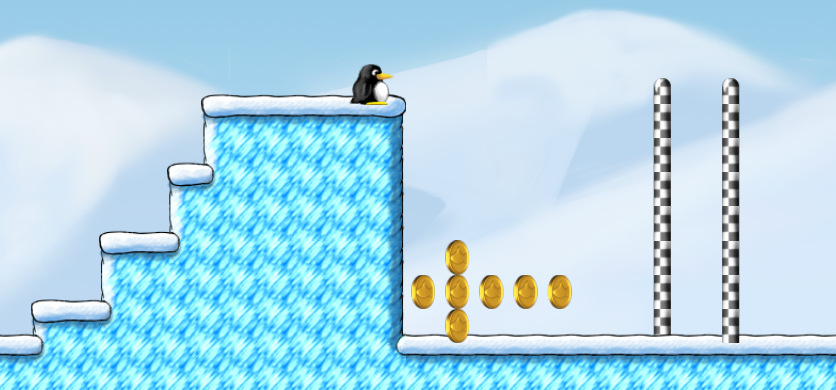
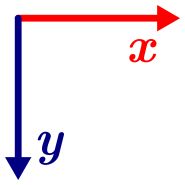

# Your first Level

Click on *Level Editor* from the title menu. Then *New level subset*. Give it a name and click *OK*. To make your first level click on *New level* and for the sake of free software we will release our level under [CC-BY-SA](https://creativecommons.org/licenses/by-sa/4.0/).

## The Interface

The panel on the right side is the place where you get all of your blocks (*Tilegroups*) and enemies (*Objects*) into your level. With the bottom panel you can easily switch between the tile maps (let *0* enabled for now&nbsp;– we will cover that later) and change background, music and the size of your sector.

When you press <kbd>ESC</kbd>, you can play and save your level and exit the editor. You can move the viewport of your level with the arrow keys. Use this to navigate through your level.

## Build a basic Level Framework

### Define the Theme of your Level

Do you want to make a forest level or an underground level or a sky level? You should have a plan for your level **first** before you start adding tiles. Everything should suit your level theme:

#### The Music

Left click on *Sector: main* at the bottom left, choose *Sector Settings* and *Music*. There is great track list to choose from. I will help you choose:

- **Antarctica:** chipdisko.ogg, voc-daytime.ogg, voc-daytime2.ogg
- **Sky:** airship_remix.ogg
- **Castle:** fortress.ogg
- **Cave:** cave.ogg, voc-dark.ogg
- **Ice Bridge:** wisphunt.ogg
- **Forest:** forest.ogg, forest2.ogg, forest3.ogg
- **Forest Castle:** fortress.ogg, darkforestkeep.ogg
- **Halloween/Ghostforest:** ghostforest.ogg, ghostforest2.ogg, greatgigantic.ogg

#### The Background

 Right click this icon in the bottom panel. You can change the top, middle and bottom of the background separately, which allows you to mix certain images. Since this is also a complete mess, I suggest you to open `/usr/share/games/supertux2/images/background/` with your file manager on Linux and pick your images there (Windows users may find this somewhere in `C:\Program Files\SuperTux\data\`). Then you can define top, middle and bottom in the editor.

#### The Ambient

If you go for a ghostforest-themed level or just want to make your level look more interesting, you can add a ambient in *Objects* > *Ambient*. The options you have include:





Click on one of these icons in the editor, then click on the level window. The ambient will be added to the bottom panel and is activated instantly.

### Let’s get started

What are the requirements for every level?

1. A Sector called *main* (we already have this&nbsp;– Tux will start in this sector)
2. A Spawn point called *main* (we already have this&nbsp;– Tux will start the level from this point)
3. Something for Tux to walk on
4. A Goal

Now we want to work on point number 3.

#### Adding Tiles

Click on Tilegroups in the top-right corner and choose a category that suits your level theme (in *Block* are tiles you need for every level). Select a tile you like by clicking on it or select multiple tiles by dragging a rectangle with your mouse. Your selection is now displayed besides the cursor. You can place it in your level as many times as you want.


- By right clicking on a tile you can copy it. It is also possible to copy a whole area by dragging a rectangle with your mouse.
- The red rectangleis the normal insert tool. By clicking this icon you can switch tools.
- With the green rectangleyou can fill rectangular areas.
- The bucket fill tool lets you fill the air tiles framed by blocks with another tile. Be careful with this tool! The editor has no undo button&nbsp;– so keep in mind to save your levels regularly!
- If you have nothing in your selection the tools work as erasers.
- You can clear your selection with the rubber or by copying an air tile.
- Clicking the wrench  invokes the same menu as pressing the <kbd>ESC</kbd> key.
- This arrow  only takes affect for objects. It has no use for tiles.

#### Adding the Goal

A SuperTux level usually ends like this:



To make the goal poles, go to *Tilegroups* > *Misc*. For the first pole you have to switch to tile map *&minus;100*. Then you can draw the pole. For the second pole you have to switch to tile map *+100*. Then you can draw the pole. Like this we have one pole in the background and the other one in the foreground which creates this cool 3D effect.

To make the igloo, go to *Tilegroups* > *Exits*. Tux’ Igloo is split up into two parts to make it look more 3D. Select the first part and paste it in tile map *&minus;100*. Then select the second part and paste it in tile map *+100*.

Now we are done visually but we still have to tell the game where the level ends. Go to *Objects* > *Ambient* and select . We are adding a object now. Objects work a little different than tiles. See the detailed explanation below when you have problems. Click on the level window and place the sequence trigger like shown in the picture. I suggest you to press <kbd>f7</kbd> to enable “Snap objects to grid”. Make sure the first sequence trigger triggers the action “end sequence“ You can change this by right clicking on the object. The sequence trigger in the igloo is used to prevent Tux from walking farther right out of the igloo. Make sure its action is set to “stop Tux”.

Congratulations! You have got everything you need for your first level. Now it is time to be creative and build your level. You can come back to this guide at any time and look up your specific problems. What do you want to do next? Add particular kinds of objects, use secret areas or work with multiple tile maps? It’s your choice!

# Adding Objects

## How does Object Mode work?

You cannot interact with tiles while you have object mode enabled after clicking on *Objects* in the top-right corner. Choose any category, for example *Hostile*. Then you can start adding objects just like tiles. But you might have noticed that a new option has appeared in the right panel. I will explain everything:

- There are two basic modes: adding/moving and erasing.
- Adding/moving can be activated with the cursor-looking arrow:Click to add an object and drag to move an existing object around.
- Erasing can be activated with the rubber:  Click on an existing object to remove it.
- Copying can be activated with the arrow pointing to the right:  The icon will change to:Drag an existing object&nbsp;– it is getting duplicated. Copying is a child action of the adding/moving mode. You must have the adding/moving mode active to make it work. The menu structure is very confusing, I know.
- Pro tip: To erase a whole area use the green rectangletogether with erasing mode.
- Clicking the wrench  invokes the same menu as pressing the <kbd>ESC</kbd> key.
- Right clicking an existing object lets you configurate its properties.

I suggest you to press <kbd>f7</kbd> to enable “Snap objects to grid”, which makes placing objects a lot easier. Of course you can disable this for more finely graduated adjusting.

## Doors

Go to *Objects* > *Interactive*. Choose the door from the list and add it. Set a spawn point (category *Ambient*) next to the door. Right click on it to give it a name, for example *spawn_door1*. You also have to right click on your door to define its destination: The “address” of the other door. For this we first need a second door. It can be in the same sector or in a different sector. To add a sector click on *Sector: main* in the bottom-left corner and *Create a new sector*. Add a door and a spawn point next to it there. Give the spawn point a name, for example *spawn_door2*.

Now you can define the destinations. Our first door should go to *spawn_door2* in *sector2*. Our second door should go to *spawn_door1* in *main*. Of course we could just omit the second door and only use the bare minimum (a spawn point) but the players expects the level to let him go back again after walking through a door.



##  Secret Areas 

Always mark a hidden bonus area with the dedicated object for it. Go to *Objects* > *Ambient* and click on the secret area icon.  Drag the object over your secret so the player gets the “You found a secret area!” message and the secret is count for the statistics.

However, the secret area object is also able to let some tiles vanish when a players touches it. By this you can hide your secrets better in your level but do not forget to give a little visual hint.



To do this, add a new tile map which covers the secret and makes it look like a solid wall. Click  and add it. A new icon appears in the bottom bar. Right click it and call it for example *secret1*. Once the tile map has a name, we can refer to it in other objects. Make sure “solid” is not ticked and change the Z&#8209;pos to *101* so that it is above everything. Add your tiles on this tile map to cover the secret. Then you can right click your secret area object and type *secret1* into the “Fade-tilemap” field. Do not forget to add tiles on your solid tile map, likely the *0* tile map. This tile map defines how the secret looks after the *secret1* has vanished.

Do not add a custom message for your secret areas unless you find somebody who is willing to translate it into all the languages!

##  Info Blocks

Go to *Objects* > *Interactive* and add the info block like any other object. Use the info block only if something does not become clear from the level itself or you want to introduce new game mechanics.

Right click the info block to add a message. You probably noticed that the first letter of every paragraph is swallowed up. This is because the first letter is used for formatting instructions:

- Use a hyphen-minus (-) for headlines.
- Use an exclamation mark (!) together with the path to an image in the supertux2 folder.
- Use a hash (#) for normal text.
- An asterisk (*) makes the text blue and centred. Use it for quotes or extra info.
- A space makes the text small. Hard to read.
- Any other character makes the text black. Hard to read.

## Moving Platforms

You can set a path where platforms, coins and even tile maps (see below) move on. To to this, add the object and click on it. An adjustment handle at the top-left corner indicates that *Following path* is activated. Platforms have this by default&nbsp;– coins and tile maps provide this as a tunable right click option.

To define the path you have to go to *Objects* > *Ambient* and select the red arrow tool  If you click anywhere in the level with this tool active, it will draw a path between the point you clicked and the last node you clicked. So to make your platform move, click the node at the top-left corner of the object and click anywhere.

The options:

- *one shot* goes from the start to the end once. Then it stops.
- *ping pong* goes back and forth infinitely like playing table tennis.
- *circular* connects the last node with the first node. The platform goes in a circle with no ending.
- *unordered* does what it wants. It even goes to nodes it is not directly connected with.

If you disable *Running*, you have to start the movement with a script. See the section below how to trigger a script.

Let’s make a platform which starts moving when Tux jumps onto it. Place a script trigger at the top side of the platform. Give the platform a unique name for example *p1*.

- `p1.start_moving();` Start the movement (affected by the option you set).
- `p1.stop_moving();` The platform stops when it reaches a node.
- `p1.goto_node($NUMBER);` The platform goes to a specific node. You start counting from 0. So `p1.goto_node(0);` lets the platform go to the beginning. Then it stops.

#  Working with multiple Tile Maps

You can use different tile maps to organize your tiles and for using different layers of tiles. You can add a tile map in *Objects* > *Ambient* and switch between them in the bottom bar.

The most obvious use case is adding foreground and background elements. *50* is the layer where Tux jumps and all the objects are placed, so every tile on a tile map above *50* is in front of the objects and everything below is … well … behind. You can change this value with the *Z&#8209;pos* property in the right click menu of the tile map.

When you edit a new level you already have three standard tile maps. Tile map *0* is solid. Use it for blocks for Tux to interact with. Tile map *&minus;100* and *+100* are not solid. Use them for background and foreground elements.

Another use case is making tiles darker or brighter. Add a new unsolid tile map and set its alpha to a value between 0 and 1 (0 is 100% transparent). Then place some black tiles in this tile map over other background blocks. You find these black tiles in *Tilegroups* > *Lightmap*. Like this you can adjust the brightness of every tile.

When you decrease the size of a tile map and enable the *Following path* property, you can move the tile map at the adjustment handle at the top-left corner around (press <kbd>f9</kbd> to hide the annoying scroller) and let it move like a moving platform! See the section above how to do this. You can get inspiration for this in the addon *Crystal Mine* by Carsten Wirtz, which uses this mechanic.

# Working with Lightmaps

Before lanterns and magic blocks can reasonably used, we have to darken the sector first. Click on *sector: main* in the bottom-left corner, then *Sector settings* > *Ambient light* and define the color using RGBA. Give each value a number between 0 and 1. I do not think that you ever have to change the alpha value, leave it 1.

Now you can go to *Objects* > *Lightmap* and add your things. Give the magic blocks you want to be made solid by a light source the same color as your lantern or spotlight.

# Using Scripts in your Level

Scripting lets you move things in your level around and change the level dynamically (It’s the JavaScript of SuperTux level editing&nbsp;– don’t overuse it!). Have a look at the [Scripting Reference](https://github.com/SuperTux/supertux/wiki/Scripting_reference#object-reference) for the commands. There are different ways to trigger a script:

-  A Script trigger object: When Tux enters this area a script gets executed.

- *Sector settings* > *Initialization script*: executed at the start of the level.
- Badguy > *Death script*: executed when a badguy dies, for example `sector.Tux.trigger_sequence("fireworks");` at yeti’s death.
- *Level properties* > *On menukey script*: No idea what this is useful for.
- Other options: button/switch press, power up picking up, Will ’O’ Wisp hit, …

# Making a Worldmap for your Levels

In the *Choose level subset* menu, select your level set and click on *Level subset properties* > *Create worldmap*. The interface should look pretty familiar. Look at the official worldmaps to get a clue how a worldmap should look like. I will show you the basics.

Build an island and draw a path on it. When you are done, go to *Objects* > *Worldmap markers* to add the level dots. Spread them all over your path. Right click on them to define the level.

Make sure the spawn point is properly set. It should be on the same block as the starting igloo. Try to make your worldmap interesting. Use forks, shortcuts and most importantly group your levels like it is done with the underground levels in Icy Island. Give the worldmap a structure and do not make your level dots too near to each other.

Before you can test your worldmap, you have to activate it. Go back again to *Level subset properties* and untick *Do not use worldmap*. After this you can test your worldmap from the title menu in *Start Game* > *Contrib Levels*.

# Making Intro/Outro Text for your Story

By making an intro or an outro you can give the player an understanding of the story. This can be a normal level or just some scrolling text over the whole screen. I’ll show you how to do the latter.

Find your levels folder:

- Linux: `/home/$USERNAME/.local/share/supertux2/levels/`
- Windows: `C:\Users\$USERNAME\AppData\Roaming\SuperTux\supertux2\levels\`

Create a new text file in the same folder where the levels of your level set are stored. Call it for example *intro.txt* and paste this into it:

```
(supertux-text			
  (background "$PATH_TO_IMAGE")
  (music "$PATH_TO_MUSIC")
  (text "$YOUR_TEXT")
)
```
Define background and music. Try for example `"nightsky_top.png"` and `"music/voc-dark.ogg"`. The text can be formatted just like the text in info blocks.

Now we have the text but we still need a way to display our text in the worldmap. For this we create a new dummy level and add a script trigger right under the spawn point. Edit the script and type `Level.finish(true);` so that the level is finished immediately. Now we can add both the text and the level to the worldmap.

In the *Choose level subset* menu, select your level set and click on *Level subset properties* > *Edit Worldmap*. If you do not already have a worldmap, see the section above to make one. Add a new level dot to make your intro or outro accessible via the worldmap. Right click on it, define the level, then click on *Outro script* and type:

```
wait_for_screenswitch();
display_text_file("levels/$LEVELSET_NAME/intro.txt");
```

The function `wait_for_screenswitch()` waits until the level is finished or the players presses <kbd>ESC</kbd>.

That’s it! When you enter the level, the text is displayed.

# Making an auto-scrolling Level

Modifying the camera is currently not supported by the level editor. Though, you can edit your level in a text editor. Save your level and close SuperTux. Find your level file:

- Linux: `/home/$USERNAME/.local/share/supertux2/levels/`
- Windows: `C:\Users\$USERNAME\AppData\Roaming\SuperTux\supertux2\levels\`

Open it with a text editor and replace `(camera)` with these lines:

```
(camera
  (name "Camera")
  (mode "autoscroll")
  (path
    (mode "oneshot")
    (node
      (x 0)
      (y 0)
      (time 200)
    )
    (node
      (x 19072)
      (y 0)
    )
  )
)
```

You can adjust the time (less is faster) or adjust the y&#8209;values to move the camera up or down (bigger is down). Right now the camera is at the top because SuperTux levels follow this coordinate system:



# Setting a Time Limit for a Sector

Setting a time limit is currently not included in the level editor. Though, you can edit your level in a text editor. Save your level and close SuperTux. Find your level file:

- Linux: `/home/$USERNAME/.local/share/supertux2/levels/`
- Windows: `C:\Users\$USERNAME\AppData\Roaming\SuperTux\supertux2\levels\`

Open it with a text editor and add these lines as a property to a sector:

```
(leveltime
   (time 20)
)
```

You can place it between `(gravity)` and `(background)`&nbsp;– it does not really matter, as long as you does not break something. Save the file.

If you open your level in the editor again, you will see that a clock icon has been added to the bottom bar. Now you can change the time graphically if you want.

# Tips and additional Resources

- You can learn a lot by looking at other people’s levels in the editor. Set *hide-from-contribs* in `/usr/share/games/supertux2/levels/world1/info` to `#f` to view the story mode levels.

- [Leveldesign guidelines](https://github.com/SuperTux/supertux/wiki/Leveldesign) in SuperTux Wiki
- [Sharing Levels](https://github.com/SuperTux/supertux/wiki/Level-Editor) in SuperTux Wiki
- [Level Format](https://github.com/SuperTux/supertux/wiki/Level-Format) in SuperTux Wiki
- [Scripting Reference](https://github.com/SuperTux/supertux/wiki/Scripting_reference#object-reference) in SuperTux Wiki
- [Scripting Guide by WeLuvGoatz](https://github.com/SuperTux/wiki/blob/1aabea8358ea9c89373e44af900fdac62a19fd53/scripting.md)
- [Illustrated Tutorial how to make a tile map moveable by VNS](https://forum.freegamedev.net/viewtopic.php?f=69&t=7265&p=74044&hilit=tilemap+move#p73970)

Any questions left? Go ahead and ask them in the [SuperTux forum](https://forum.freegamedev.net/viewforum.php?f=66)!

This page is licensed under [CC-BY-SA](https://creativecommons.org/licenses/by-sa/4.0/).
